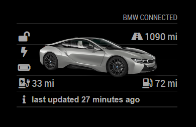

# MMM-BMWConnected
Magic Mirror Module to display data from BMW Connected drive for your car.

The module displays icons to show lock, charging and battery status, electric and combined range, and total miles driven. It also shows the time the Connected Drive API last received data from the car.

## Installation

Clone this repository in your modules folder, and install dependencies:

    cd ~/MagicMirror/modules 
    git clone https://github.com/hdurdle/MMM-BMWConnected.git
    cd MMM-BMWConnected
    npm install 

## Configuration

Go to the MagicMirror/config directory and edit the config.js file. Add the module to your modules array in your config.js.

You'll need your BMW Connected Drive email and password.

Enter these details in the config.js for your MagicMirror installation:

        {
            module: "MMM-BMWConnected",
            header: 'BMW Connected',
            position: "top_right",
            config: {
                email: "email@example.com",
                password: "myComplexPassword"
            }
        },

## Module configuration
The module has a few configuration options:

<table>
  <thead>
    <tr>
      <th>Option</th>
      <th>Description</th>
    </tr>
  </thead>
  <tbody>
    <tr>
      <td><code>email</code></td>
      <td>Your username or email for the BMW Connected Drive platform.  <strong>Default: </strong><code>undefined</code></td>
    </tr>
        <tr>
      <td><code>password</code></td>
      <td>Your password for the BMW Connected Drive platform.  <strong>Default: </strong><code>undefined</code></td>
    </tr>
            <tr>
      <td><code>apiBase</code></td>
      <td>The location of the base API URL for your region.  <strong>Default: </strong><code>www.bmw-connecteddrive.co.uk</code></td>
    </tr>
    <tr>
      <td><code>refresh</code></td>
      <td>How often to refresh the data in minutes.   <strong>Default: </strong><code>15</code> </td>
    </tr>
        <tr>
      <td><code>vehicleAngle</code></td>
      <td>The angle of rotation for the car image.   <strong>Default: </strong><code>300</code> Between 0 and 350 in increments of 10.</td>
    </tr>
  </tbody>
</table>

## Notes

If possible the module will pull an image of your car from BMW's API. I only have one BMW, so can't test the placement/graphics of other vehicles. I'd love to see what it looks like if you try it.  Tweet images to me at https://twitter.com/hdurdle 

## Thanks

Hat tip to [Nils Schneider](https://github.com/Lyve1981/BMW-ConnectedDrive-JSON-Wrapper) for the library code for performing the BMW authentication dance.